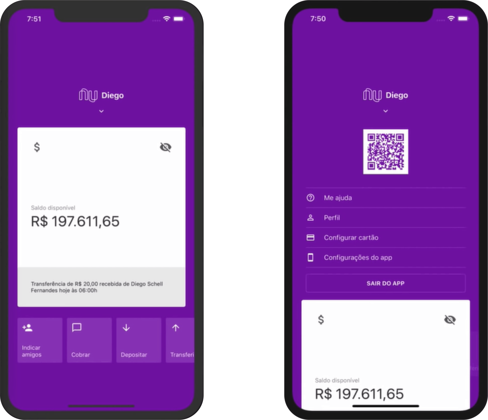

# mybank-interface
A bank interface with great concepts of UX and interaction. Inspired in the brazilian NuBank app.

<h1 align="center">
    MyBank Interface
</h1>

<h4 align="center">
  ☕ Code and coffee
</h4>

  <a href="#rocket-tecnologias">Tecnologies</a>&nbsp;&nbsp;&nbsp;|&nbsp;&nbsp;&nbsp;
  <a href="#-projeto">Projeto</a>&nbsp;&nbsp;&nbsp;|&nbsp;&nbsp;&nbsp;
  <a href="#-como-contribuir">How to contribute</a>&nbsp;&nbsp;&nbsp;|&nbsp;&nbsp;&nbsp;
  <a href="#memo-licença">License</a>

 

  

## :rocket: Tecnologias
This project is being created using the following technologies:

- [React Native](https://facebook.github.io/react-native/)

## 💻 Project

A bank modern and easy-going experience interface.

## 🤔  Want to be a part?

- Fork this repository;
- Create a branch with your feature: `git checkout -b minha-feature`;
- Commit you alterations: `git commit -m 'feat: Minha nova feature'`;
- Push it to your branch: `git push origin minha-feature`.

## :memo: License

MIT.  [LICENSE](LICENSE) para mais detalhes.
